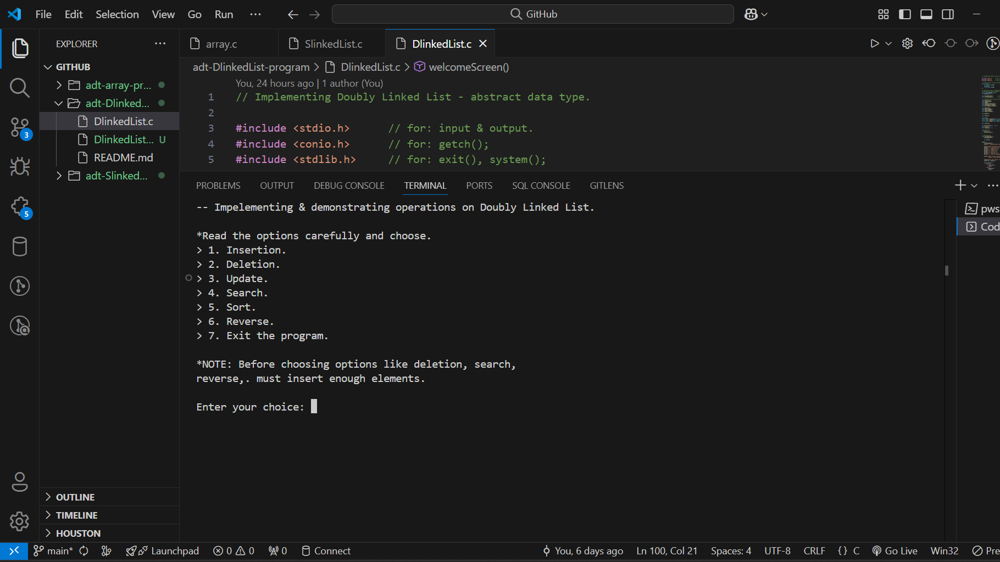
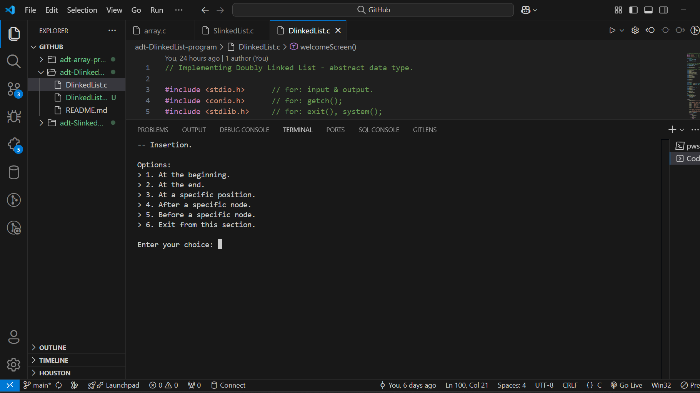
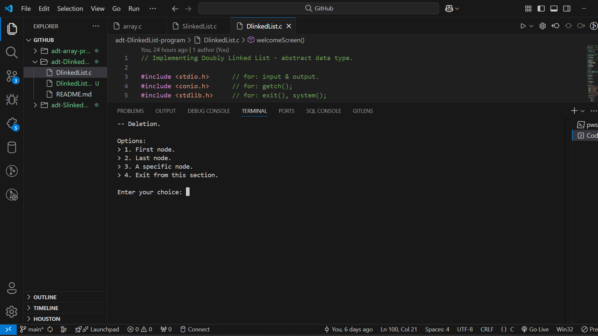

# adt-DlinkedList-program
C program implementing and demonstrating operations on Doubly Linked List. Designed to help beginners understand operations related to Doubly Linked List.



## Features
- Operation including: [Insertion](#insertion-operations), [Deletion](#deletion-operations), [Updation](#update-function), [Searching](#search-function), [Sorting](#sort-functions), [Reverse](#reverse-function).
- Menu driven program for easy interaction.
- Simple and clean code structure.

## Project Structure
```
adt-DlinkedList-program/
|-- DlinkedList.c  # Main program implementing ADT Doubly Linked List
|-- README.md  # Project documentation
```

## Requirements
- **C Compiler** (GCC, MinGW, or any compatible)
- **VS Code** or any code editor

## Installation Guide
- Clone the repository using HTTP/SSH URL.
```bash
git clone https://github.com/gulshan-41/adt-DlinkedList-program.git
```
- Navigate to the project directory.
```bash
cd adt-DlinkedList-program.
```

## Program Variables
- struct node { struct node *linkP; int data; struct node *linkN; };
- struct node *headN = NULL;
- int nodeCounter = 1;


## Program Functions
Main functions that construct the whole program includes, main(), welcomeScreen(), insertion(), deletion(), update(), search(), sort(), & reverse().

## Insertion Operations



- Insert a node at the beginning of the list.
```bash
void atBeginning() {
    struct node *newNode = malloc(sizeof(struct node));
    if (!newNode) {
        printf("\nError: Memory allocation failed!.\n");
        exit(1);
    }

    printf("\nnewNode->data: ");
    scanf("%d", &(newNode->data));

    newNode->linkN = headN;
    newNode->linkP = NULL;
    headN = newNode;

    nodeCounter++;
}
```
- Insert a node at the end of the list.
```bash
void atEnd() {
    struct node *newNode = malloc(sizeof(struct node));
    if (!newNode) {
        printf("\nError: Memory allocation failed!.\n");
        exit(1);
    }

    printf("\nnewNode->data: ");
    scanf("%d", &(newNode->data));

    struct node *end = headN;
    newNode->linkN = NULL;
    newNode->linkP = NULL;
            
    while(end->linkN != NULL) {
        end = end->linkN;
    }
    end->linkN = newNode;
    newNode->linkP = end;

    nodeCounter++;
}
```
- Insert a node at a specified serial number.
```bash
void atSpecificPosition() {
    int index;

    struct node *newNode = malloc(sizeof(struct node));
    if (!newNode) {
        printf("\nError: Memory allocation failed!.\n");
        exit(1);
    } else {
        printf("\nnewNode->data: ");
        scanf("%d", &(newNode->data));
        newNode->linkN = NULL;
        newNode->linkP = NULL;
        printf("serial: ");
        scanf("%d", &index);

        struct node *p = headN;

        // The serial number should be between the list, or at the end.
        if(index > nodeCounter + 1 || index < 1) {
            printf("\nError: Enter a valid serial number.");
            printf("\nPress any key to continue...");
            getch();
            insertion();
        } else if(index == 1) {
            newNode->linkN = headN;
            newNode->linkP = NULL;
            headN = newNode;
        } else {
            index = index - 1;
            while(index != 1) {
                p = p->linkN;
                index--;
            }
            newNode->linkN = p->linkN;
            newNode->linkP = p;
            p->linkN = newNode;
        }
    }

    nodeCounter++;
}
```
- Insert a node "after" a specified node (by value), the first occuring would be considered.
```bash
void afterASpecificNode() {
    int target, i , choice, flag = 0;

    if(headN == NULL) {
        printf("\nError: The list is empty.\n");
        printf("Press any key to continue...");
        getch();
        welcomeScreen();
    }

    printL();
    printf("*Searching it by value, the first occuring would be considered.\n\n");
    printf("element: ");
    scanf("%d", &target);

    struct node *p = headN;

    for(i = 1; i <= nodeCounter; i++) {
        if(target == p->data) {
            flag++;
            break;
        }
        p = p->linkN;
    }

    if(flag == 0) {
        printf("\nError: Element not found! Check the list & enter a valid element.");
        printf("\nPress any key to continue...");
        getch();
        insertion();
    }

    struct node *newNode = malloc(sizeof(struct node));
    if (!newNode) {
        printf("\nError: Memory allocation failed!.\n");
        exit(1);
    }
    printf("newNode->data: ");
    scanf("%d", &(newNode->data));

    newNode->linkN = p->linkN;
    p->linkN = newNode;
    newNode->linkP = p;

    nodeCounter++;
}
```
- Insert a node "before" a specified node (by value), the first occuring would be considered.
```bash
void beforeASpecificNode() {
    int target, i , choice, flag = 0;

    if(headN == NULL) {
        printf("\nError: The list is empty.\n");
        printf("Press any key to continue...");
        getch();
        welcomeScreen();
    }

    printL();
    printf("*Searching it by value, the first occuring would be considered.\n\n");
    printf("element: ");
    scanf("%d", &target);

    struct node *p1 = headN;
    struct node *p2 = NULL;

    for(i = 1; i <= nodeCounter; i++) {
        if(target == p1->data) {
            flag++;
            break;
        }
        p2 = p1;
        p1 = p1->linkN;
    }

    if(flag == 0) {
        printf("\nError: Element not found! Check the list & enter a valid element.");
        printf("\nPress any key to continue...");
        getch();
        insertion();
    }

    struct node *newNode = malloc(sizeof(struct node));
    if (!newNode) {
        printf("\nError: Memory allocation failed!.\n");
        exit(1);
    }
    printf("newNode->data: ");
    scanf("%d", &(newNode->data));

    if (p2 == NULL) {
        newNode->linkN = headN;
        headN->linkP = newNode;
        headN = newNode;
    } else {
        newNode->linkN = p1;
        newNode->linkP = p2;
        p2->linkN = newNode;
        p1->linkP = newNode;
    }

    nodeCounter++;
}
```


## Deletion Operations



- Deleting the first node of the list.
```bash
void theFirstNode() {
    struct node *p = headN;
    headN = (headN)->linkN;
        
    free(p);
    p = NULL;

    nodeCounter--;
}
```
- Deleting the last node of the list.
```bash
void theLastNode() {
    if((headN)->linkN == NULL) {
        free(headN);
        headN = NULL;
    } else {
        struct node *p1 = headN;
        struct node *p2 = NULL;

        while(p1->linkN != NULL) {
            p2 = p1;
            p1 = p1->linkN;
        }
        p2->linkN = NULL;
        free(p1);
        p1 = NULL;
    }

    nodeCounter--;
}
```
- Deletes a specific node, specified with it's serial number, & data inside it.
```bash
void aSpecificNode() {
    int index, data, verify = 0;
    int errorCode;
    struct node *p = headN;

    printf("\n*NOTE: Enter the serial no. & data inside\n"
           "the node to verify it's presence.\n");

    printL();

    printf("\nserial no.: ");     
    scanf("%d", &index);

    printf("data: ");       
    scanf("%d", &data);

    errorCode = verification(index, data);
    if(errorCode == 4) {
        printf("\nError: Enter a valid serial number.");
        printf("\nPress any key to continue...");
        getch();
        deletion();
    } else if(errorCode == 5) {
        printf("\nError: The element is not present at the\n"
               "specified serial number. ");
        printf("\nPress any key to continue...");
        getch();
        deletion();
    }

    if(index == 1) {
        p = headN;
        headN = (headN)->linkN;
        
        free(p);
        p = NULL;
    } else {
        struct node *p1 = headN;
        struct node *p2 = NULL;
        struct node *temp = NULL;

        for(int i = 1; i < index; i++) {
            p2 = p1;
            p1 = p1->linkN;
        }

        if(p1->linkN == NULL) {
            p2->linkN = p1->linkN;
        } else {
            temp = p1->linkN;
            p2->linkN = p1->linkN;
            temp->linkP = p2;
        }
        
        free(p1);
        p1 = NULL;
    }

    nodeCounter--;
}
```

## Update Function
- Update nodes with new data.
```bash
void update() {
    screenCleaner();

    int serial, data, uData, choice, errorCode;

    printf("Which node do you want to update?");
    printL();

    printf("\nserial no.: ");
    scanf("%d", &serial);
    printf("node's data: ");
    scanf("%d", &data);

    errorCode = verification(serial, data);
    if(errorCode == 4) {
        printf("\nError: Enter a valid serial number.");
        printf("\nPress any key to continue...");
        getch();
        update();
    } else if(errorCode == 5) {
        printf("\nError: The element is not present at the\n"
               "specified serial number. ");
        printf("\nPress any key to continue...");
        getch();
        update();
    }

    printf("\nnew->data: ");
    scanf("%d", &uData);

    struct node *p = headN;

    for(int i = 1; i < serial; i++) {
        p = p->linkN;
    }

    p->data = uData;

    printL();

    printf("\n> 1. Continue to update more elements.\n");
    printf("> 2. Exit from this section.\n");
    printf("\nyour choice: ");
    scanf("%d", &choice);

    switch(choice) {
        case 1:
            update();
            break;
        case 2:
            welcomeScreen();
            break;
        default:
            printf("\nError: Choose from the given options.");
            printf("\nPress any key to continue...");
            getch();
            welcomeScreen();
    }
}
```

## Search Function
- Search a specific node via it's data.
```bash
void search() {
    screenCleaner();

    int target, i, flag = 0, choice;

    if(headN == NULL) {
        printf("\nError: The list is empty.\n");
        printf("Press any key to continue...");
        getch();
        welcomeScreen();
    }

    printL();

    printf("\nelement: ");
    scanf("%d", &target);

    struct node *p = headN;

    for(i = 1; i <= nodeCounter; i++) {
        if(target == p->data) {
            flag++;
            break;
        }
        p = p->linkN;
    }

    if(flag == 1) {
        printf("\nserial no.: %d\n", i);
    } else {
        printf("\nelement not found!\n");
    }

    printf("\n> 1. Continue to search elements.\n");
    printf("> 2. Exit from this section.\n");
    printf("\nyour choice: ");
    scanf("%d", &choice);

    switch(choice) {
        case 1:
            search();
            break;
        case 2:
            welcomeScreen();
            break;
        default:
            printf("\nError: Choose from the given options.");
            printf("\nPress any key to continue...");
            getch();
            welcomeScreen();
    }
}
```

## Sort Functions
- Sort the list (in ascending order) using merge sort algorithm.
```bash
struct node * mergeSort(struct node *headN) {

    if (headN == NULL || headN->linkN == NULL) {
        return headN;
    }

    struct node *second = split(headN);

    headN = mergeSort(headN);
    second = mergeSort(second);

    return merge(headN, second);
}
```
```bash
struct node * split(struct node *headN) {

    struct node *fast = headN->linkN;
    struct node *slow = headN;

    while (fast != NULL && fast->linkN != NULL) {
        fast = fast->linkN->linkN;
        slow = slow->linkN;
    }

    struct node *temp = slow->linkN;
    slow->linkN = NULL;
    return temp;
}
```
```bash
struct node * merge(struct node * first, struct node * second) {

    if(first == NULL) return second;
    if(second == NULL) return first;

    if(first->data < second->data) {
        first->linkN = merge(first->linkN, second);
        second->linkP = first;
        return first;
    } else {
        second->linkN = merge(first, second->linkN);
        first->linkP = second;
        return second;
    }
}
```
## Reverse Function
- Reverse the list.
```bash
void reverse() {
    screenCleaner();

    int choice;

    printL();

    if(headN == NULL || headN->linkN == NULL) {
        printf("\nError: The list is empty or it has only one node!\n");
        printf("Press any key to continue...");
        getch();
        welcomeScreen();
    }

    struct node *prev = NULL;
    struct node *current = headN;
    struct node *next = NULL;

    while (current != NULL) {
        next = current->linkN;
        current->linkN = prev;
        current->linkP = next;
        prev = current;
        current = next;
    }

    headN = prev;

    printL();

    printf("\n> 1. Reverse one more time OR.\n");
    printf("> 2. Exit from this section.\n");
    printf("\nyour choice: ");
    scanf("%d", &choice);

    switch(choice) {
        case 1:
            reverse();
            break;
        case 2:
            welcomeScreen();
            break;
        default:
            printf("\nError: Choose from the given options.");
            printf("\nPress any key to continue...");
            getch();
            welcomeScreen();
    }
}
```

## Helper Functions
- Helper functions include,. printL(), screenCleaner(), tryAgain(int ) & verification(int , int ).

## Contact
For queries, feel free to reach out:
- Email: main.gulshan2003@gmail.com
- GitHub: [gulshan-41](https://github.com/gulshan-41)
